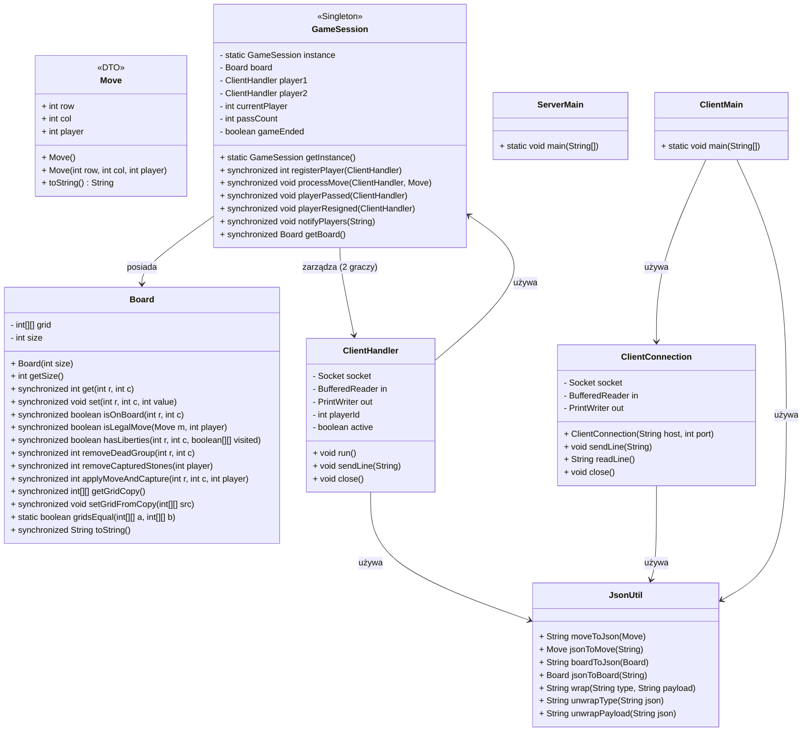

```mermaid
classDiagram
direction TB

    %% ======================
    %% COMMON
    %% ======================
    class Move {
        <<DTO>>
        + int row
        + int col
        + int player
        + Move()
        + Move(int row, int col, int player)
        + toString() String
    }

    class Board {
        - int[][] grid
        - int size

        + Board(int size)
        + int getSize()
        + synchronized int get(int r, int c)
        + synchronized void set(int r, int c, int value)

        + synchronized boolean isOnBoard(int r, int c)
        + synchronized boolean isLegalMove(Move m, int player)
        + synchronized boolean hasLiberties(int r, int c, boolean[][] visited)
        + synchronized int removeDeadGroup(int r, int c)
        + synchronized int removeCapturedStones(int player)

        + synchronized int applyMoveAndCapture(int r, int c, int player)

        + synchronized int[][] getGridCopy()
        + synchronized void setGridFromCopy(int[][] src)
        + static boolean gridsEqual(int[][] a, int[][] b)

        + synchronized String toString()
    }

    class JsonUtil {
        + String moveToJson(Move)
        + Move jsonToMove(String)
        + String boardToJson(Board)
        + Board jsonToBoard(String)
        + String wrap(String type, String payload)
        + String unwrapType(String json)
        + String unwrapPayload(String json)
    }


    %% ======================
    %% SERVER
    %% ======================
    class GameSession {
        <<Singleton>>
        - static GameSession instance
        - Board board
        - ClientHandler player1
        - ClientHandler player2
        - int currentPlayer
        - int passCount
        - boolean gameEnded

        + static GameSession getInstance()
        + synchronized int registerPlayer(ClientHandler)
        + synchronized void processMove(ClientHandler, Move)
        + synchronized void playerPassed(ClientHandler)
        + synchronized void playerResigned(ClientHandler)
        + synchronized void notifyPlayers(String)
        + synchronized Board getBoard()
    }

    class ClientHandler {
        - Socket socket
        - BufferedReader in
        - PrintWriter out
        - int playerId
        - boolean active

        + void run()
        + void sendLine(String)
        + void close()
    }

    class ServerMain {
        + static void main(String[])
    }


    %% ======================
    %% CLIENT
    %% ======================
    class ClientConnection {
        - Socket socket
        - BufferedReader in
        - PrintWriter out

        + ClientConnection(String host, int port)
        + void sendLine(String)
        + String readLine()
        + void close()
    }

    class ClientMain {
        + static void main(String[])
    }


    %% ======================
    %% RELATIONS
    %% ======================

    GameSession --> Board : posiada
    GameSession --> ClientHandler : zarządza (2 graczy)
    ClientHandler --> GameSession : używa
    ClientHandler --> JsonUtil : używa
    ClientConnection --> JsonUtil : używa
    ClientMain --> ClientConnection : używa
    ClientMain --> JsonUtil : używa
```